  

# 🚀 Awesome User Onboarding

  
  
  
  
  
  
  

---

### 🌟 Ultimate Ecosystem of SaaS Platforms & Open-Source User Onboarding Tools

> **A curated collection of the best SaaS products and open-source GitHub repositories for interactive product tours, onboarding checklists, feature adoption, tooltips, digital adoption platforms (DAP), and in-app guidance.**  
> *Last updated: August 2026*

Effective **user onboarding** accelerates time-to-value (TTV), increases product activation, improves user retention, and supercharges product-led growth (PLG). Whether you are looking for a comprehensive no-code enterprise SaaS platform or lightweight, developer-first open-source tour libraries for React, Vue, Angular, Next.js, or vanilla JavaScript, this directory serves as your ultimate guide.

---

## 📑 Table of Contents
- [🎯 SaaS / Hosted Platforms (Sorted by Scale & Valuation)](#-saashosted-platforms)
- [💻 Open-Source GitHub Projects (Sorted by Star Counts)](#-open-source-github-projects)
- [🧩 Key Comparison & Architectural Selection Guide](#-key-comparison--architectural-selection-guide)
- [🤝 How to Contribute](#-how-to-contribute)
- [📈 Star History](#-star-history)
- [📜 Disclaimer](#-disclaimer)

---

## 🎯 SaaS/Hosted Platforms

*Ranked and sorted in descending order by **Company Scale / Valuation / Revenue**.*

| 🏷️ Product | 🏢 Company Scale / Valuation / Revenue | 📝 Description | 💳 Starting Price | 🎁 Free Tier / Trial Limits |
| :--- | :--- | :--- | :--- | :--- |
| **[Guidde](https://www.guidde.com/)** | **~$200M+ Est. Valuation** • $80.6M Total Funding ($50M Series B in 2026) • 3x YoY ARR Growth (~$6.5M–$10M ARR) | 🤖 AI-powered generative video documentation and interactive guided walkthroughs created automatically from screen recordings. | **$23/creator/month** (Pro plan, billed annually) / **$44/creator/month** (Business) | **Free forever plan** (up to 25 videos, web capture, browser extension) + **7-day free trial** for Business tier (AI voiceovers, brand kits) |
| **[Userflow](https://www.userflow.com/)** | **$60M+ Valuation** • Acquired by Beamer for $60M+ • $4.6M ARR at acquisition (100% bootstrapped) | ⚡ Developer-friendly and no-code hybrid platform for building sophisticated in-app onboarding flows, checklists, and resource centers. | **$100/month** (Adoption Agent) / **$500/month** (Adoption Studio, up to 3,000 MAUs) | **14-day free trial** (full feature access to flows, checklists, launchers, sandbox & live preview, no credit card required) |
| **[Appcues](https://www.appcues.com/)** | **$47.9M Funding / ~$16.7M ARR** • $32.1M Series B • Pioneer & category leader in PLG onboarding | 🎨 Industry-standard no-code user onboarding platform for product tours, modals, tooltips, and personalized flows with deep analytics & mobile support. | **$249/month** (Essentials plan, billed annually; up to 2,500 MAUs) | **14-day free trial** (full access to builder, sandbox testing environment, no credit card required; extendable +14 days upon SDK install) |
| **[CommandBar](https://www.commandbar.com/)** | **$45M+ Valuation** • Acquired by Amplitude for $45M+ • $23.8M VC raised (~$3.3M ARR) | 🔍 AI-powered in-app user assistance, contextual search bars, user nudges, and product tours for seamless feature adoption. | **$249/month** (Starter tier; up to 1,000–2,500 MAUs) | **14-day free trial** (access to AI assistant nudges, contextual search, and in-app tours; previously had free tier up to 1,000 MAUs) |
| **[Nickelled (Omniplex Guide)](https://www.omniplex.ai/)** | **£24M+ (~$31M) Parent Revenue** • Part of Omniplex Learning (LDC private equity) • 83% Recurring Revenue | 👔 Enterprise-grade guided onboarding and in-system software training with strong integrations for complex web and SaaS environments. | **$199/month – $249/month** (Core plan; up to 2,500 MAUs, unlimited guides) | **14-day free trial** (full access to create website/app walkthroughs for up to 2,500 MAUs, no credit card required) |
| **[Stonly](https://stonly.com/)** | **$25.5M Funding / ~$11.2M ARR** • Series A funded • High-growth knowledge & adoption platform | 📚 Interactive step-by-step guides, dynamic knowledge bases, self-serve troubleshooting, and in-app customer onboarding. | **$199/month** (Small Business plan, billed annually; $249/mo monthly) | **Free forever plan** (up to 5 published guides, 400 guide views/month, 1 team member) + **14-day free trial** for Small Business plan |
| **[Chameleon](https://www.chameleon.io/)** | **$13M Funding / ~$12.2M ARR** • Series A (Matrix Partners) • 5x Enterprise segment growth | 🎨 Design-first product adoption platform for native-feeling tours, tooltips, banners, checklists, and microsurveys with deep CSS control. | **$279/month** (Startup plan; up to 2,000 Monthly Tracked Users) | **14-day free trial** (full enterprise-level access to all features, AI agents, and unlimited experience builds, no credit card required) |
| **[Userpilot](https://userpilot.com/)** | **$4.73M Funding / ~$9.5M–$12M ARR** • Series A funded • Highly profitable scale | 📊 Behavior-driven product adoption engine with in-app tours, tooltips, checklists, surveys, user segmentation, and product analytics. | **$299/month** (Starter plan, billed annually; up to 2,000 MAUs) | **14-day free trial** (full access to in-app tours, surveys, checklists, and user tracking up to 2,000 MAUs, no credit card required) |
| **[Inline Manual](https://www.inlinemanual.com/)** | **~$1M–$1.5M ARR** • Bootstrapped & independent • Established digital adoption pioneer | 🛠️ Mature digital adoption platform (DAP) offering flexible step-by-step guides, tooltips, walkthroughs, version control, and multi-language support. | **$158/month** (Standard Pro plan; up to 250 MAUs) | **14-day free trial** (fully functional account with authoring extension, interactive player, analytics, no credit card required) |
| **[Hopscotch](https://hopscotch.club/)** | **~$20K–$50K ARR** • Bootstrapped startup builder • Focused on early-stage SaaS | 💡 Affordable, streamlined no-code product tour and tooltip builder crafted for indie hackers, early-stage SaaS founders, and nimble product teams. | **$99/month** (Standard plan) / **$249/month** (Growth plan, up to 3,000 users) | **Free development trial** (unlimited testing and tour creation in staging/sandbox; pay only when pushing experiences live) |
| **[Clew](https://tryclew.io/)** | **Bootstrapped, no funding raised** • Revenue not disclosed • Self-hosted edition licensed AGPL-3.0, commercial licence available | 🧵 Tooltip tours, modals, onboarding checklists and a two-step rating popup from one script tag, authored in a visual editor on the live site; A/B tests report a p-value against a pre-planned sample. EU cloud or self-hosted on your own server. | **$14.99/month** (Pro) / **$39.99/month** (Business) / **$499** once (Lifetime) / **$1,499** once (self-hosted licence) | **Free plan with no time limit** (1 site, 1 seat, tours and tooltips, up to 3 published tours, Clew badge on tooltips) + **14-day trial** on the paid plans, no card |

---

## 💻 Open-Source GitHub Projects

*Ranked and sorted in descending order by **GitHub Star Count**.*

1. ### **[Driver.js](https://github.com/kamranahmedse/driver.js)** 
   - 🌟 **Stars:** ~26.6k+ | 📦 **Stack:** Vanilla JS / TypeScript (Zero Dependencies)
   - 📖 **Overview:** A light-weight, highly customizable vanilla JavaScript library to drive user focus across your web application. Supports step-by-step product tours, element highlighting, popover overlays, keyboard navigation, and seamless integration with any modern framework (React, Vue, Angular, Svelte).

2. ### **[Intro.js](https://github.com/usablica/intro.js)** 
   - 🌟 **Stars:** ~23.5k+ | 📦 **Stack:** Vanilla JS / CSS
   - 📖 **Overview:** The classic, battle-tested library for step-by-step guide and feature introductions. Offers full cross-browser compatibility, responsive design, progress indicators, and keyboard shortcuts with extensive styling options.

3. ### **[Shepherd.js](https://github.com/shipshapecode/shepherd)** 
   - 🌟 **Stars:** ~13.3k+ | 📦 **Stack:** JavaScript / Floating UI (React, Vue, Angular, Ember, Svelte)
   - 📖 **Overview:** Highly flexible, accessible, and customizable open-source tour library leveraging Floating UI for pixel-perfect positioning. Maintained actively by Ship Shape with official first-class wrappers for all major frontend frameworks.

4. ### **[React Joyride](https://github.com/gilbarbara/react-joyride)** 
   - 🌟 **Stars:** ~7.8k+ | 📦 **Stack:** React / TypeScript
   - 📖 **Overview:** The most popular React-specific tour component. Provides controlled and uncontrolled tour modes, custom beacon triggers, flexible tooltips, scrolling automation, and rich callback actions for complex onboarding flows.

5. ### **[Bootstrap Tour](https://github.com/sorich87/bootstrap-tour)** 
   - 🌟 **Stars:** ~4.4k+ | 📦 **Stack:** JavaScript / Bootstrap / jQuery
   - 📖 **Overview:** Quick and easy product tour popup engine built on top of Twitter Bootstrap popovers. Ideal for legacy dashboards and Bootstrap-based web applications.

6. ### **[Reactour](https://github.com/elrumordelaluz/reactour)** 
   - 🌟 **Stars:** ~4.1k+ | 📦 **Stack:** React / Styled Components
   - 📖 **Overview:** Accessible, customizable tour component for React apps with SVG masking, smooth transitions, custom step components, keyboard controls, and multi-step walkthrough support.

7. ### **[Hopscotch (JS Library)](https://github.com/linkedin/hopscotch)** 
   - 🌟 **Stars:** ~3.4k+ | 📦 **Stack:** JavaScript
   - 📖 **Overview:** LinkedIn's open-source framework designed for developers to easily add interactive product tours across multi-page web applications with event callbacks and state persistence.

8. ### **[Usertour](https://github.com/usertour/usertour)** 
   - 🌟 **Stars:** ~2.2k+ | 📦 **Stack:** Full-Stack (Next.js / Node / PostgreSQL / SDK)
   - 📖 **Overview:** The full open-source alternative to Appcues and Userflow. Self-hostable user onboarding platform featuring a no-code visual builder, audience targeting, product tours, checklists, banners, user feedback widgets, and analytics.

9. ### **[Onborda](https://github.com/frontendfyi/onborda)** 
   - 🌟 **Stars:** ~1.4k+ | 📦 **Stack:** Next.js / React / Tailwind CSS / Framer Motion
   - 📖 **Overview:** Modern, beautifully animated onboarding wizard library crafted for Next.js App Router and Tailwind CSS, featuring smooth Framer Motion transitions and custom card styling.

10. ### **[Tour Kit](https://github.com/domidex01/tour-kit)** 
    - 🌟 **Stars:** ~500+ | 📦 **Stack:** React / TypeScript (Headless)
    - 📖 **Overview:** Headless, TypeScript-first React component library for product tours, hints, checklists, announcements, and microsurveys — giving engineering teams 100% control over design and code ownership.

11. ### **[GuideChimp](https://github.com/Labs64/GuideChimp)** 
    - 🌟 **Stars:** ~240+ | 📦 **Stack:** JavaScript / TypeScript / Chrome Extension
    - 📖 **Overview:** Lightweight, extensible guided tour engine with zero-code browser extension authoring, multi-page tour navigation, HTML5 audio narration support, and plugin architecture.

12. ### **[React User Tour](https://github.com/stalniy/react-user-tour)** 
    - 🌟 **Stars:** ~150+ | 📦 **Stack:** React
    - 📖 **Overview:** Simple, lightweight React component library designed for minimal, dependency-light tour setups and tooltip walkthroughs.

13. ### **[Trailguide](https://github.com/hellotrailguide/trailguide)** 
    - 🌟 **Stars:** ~120+ | 📦 **Stack:** Playwright / TypeScript / Git-Native
    - 📖 **Overview:** Unique developer tool that records UI walkthroughs and compiles them into both user-facing onboarding guides and automated Playwright regression test suites from a single JSON definition.

---

## 🧩 Key Comparison & Architectural Selection Guide

| Criteria | 🏢 SaaS Platforms (Appcues, Userpilot, Chameleon, Userflow) | 💻 Open-Source Code Libraries (Driver.js, Shepherd.js, Joyride) | 🏗️ Self-Hosted Platforms (Usertour) |
| :--- | :--- | :--- | :--- |
| **Builder Type** | Visual No-Code WYSIWYG Chrome Extension | Code-driven (JSX, TS, JSON definitions) | Visual No-Code + SDK |
| **Data Privacy** | Cloud-hosted (vendor manages data) | 100% In-house (Zero third-party transmission) | Self-hosted (your own cloud/VPC) |
| **Engineering Effort** | Low (Single script install + PM authoring) | Moderate (Developer writes tour steps & logic) | Moderate (One-time DevOps deploy + PM builder) |
| **Custom Styling** | Themes & Custom CSS Overrides | 100% Native Design System integration | Tailwind / CSS customizer |
| **Cost Structure** | Monthly subscription scaling with MAUs ($99–$1,000+/mo) | **$0 / Free & Open Source (MIT License)** | **$0 License (Infrastructure hosting only)** |
| **Target Audience** | Growth teams, PMs, non-technical marketers | Frontend engineers & product designers | Full-stack teams seeking open data ownership |

---

## 🤝 How to Contribute

We love contributions from the community! 💖

1. 🍴 Fork this repository.
2. 🌿 Create a descriptive branch (`git checkout -b feature/add-new-tool`).
3. 📝 Add your tool to the table or list (ensure factual descriptions, valid pricing/star counts, and alphabetical/metric order).
4. 🚀 Commit your changes (`git commit -m 'feat: Add NewOnboardingTool'`).
5. 📬 Open a Pull Request for review.

---

## 📈 Star History

---

## 📜 Disclaimer

- This is a **community-curated** list for educational and informational purposes — entries do not constitute direct endorsements.
- Always ensure in-app onboarding experiences adhere to web accessibility (WCAG 2.1 AA) and user privacy regulations (GDPR, CCPA).
- Pricing and company valuation figures are based on publicly verified filings, venture reports, and platform databases as of August 2026.

---

  Built with ❤️ for product managers, growth designers, frontend engineers, and SaaS founders worldwide.

